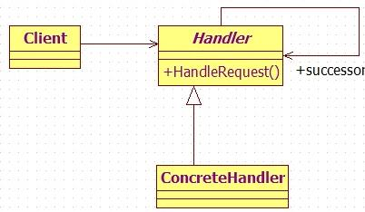

#责任链模式

#####前言：
在软件开发过程中，通常需要处理一些并不明确的请求，面对这些请求，开发者会事先定义多个处理对象，由这些处理对象逐一处理该请求，最总找出一个最适合的处理对象来处理该请求。下面我举一个生活场景帮助理解。  
小张在上海工作一段时间后希望能办理上海居住证， 不过这可是一个麻烦事，需要提前准备不少的材料以及是否具备申请的资格。首先需要准备好连续6个月的社保证明，以及在小区居住的证明等，然后携带齐全的资料去各个部门逐一申请。  
我们把小张的申请看成是一个请求，把各个机关部门看成是接受这个请求的处理对象。部门有好几个，首先是小区的物业，需要给你开小区居住证明，然后是社区服务中心，合适你的居住情况已经资格审核。最终将审核通过的资料一并到公安部门进行核实并开出上海居住证。  
这个例子讲述的就是责任链模式，一个请求，对应多个不同的处理对象，每个处理对象需要判断当前请求的级别，最总决定是否处理，或者移交给下一个对象处理。这样做的优点是客户只要准备好申请资料，将申请交给第一个部门，然后部门会依次根据你当前的申请阶段进行处理。不必用户东跑西跑找不到北。  
接下来根据这个例子来写一段样例代码。  

#####样例代码
```
/**
 * 封装请求对象
 * @author kexun
 *
 */
public class ResidencePermitRequest {

	public final static int LEVEL_WUYE = 1;
	public final static int LEVEL_SHEQU = 2;
	public final static int LEVEL_GONGAN = 3;
	
	private int level;
	
	public ResidencePermitRequest() {
	}
	
	public int getLevel() {
		return level;
	}
	
	public void setLevel(int level) {
		this.level = level;
	}
}

/**
 * 封装返回对象
 * @author kexun
 *
 */
public class ResidencePermitResponse {

	private String message;
	
	public ResidencePermitResponse(String msg) {
		this.message = msg;
	}

	public String getMessage() {
		return message;
	}

}

/**
 * 请求处理抽象类
 * @author kexun
 *
 */
public abstract class ResidencePermitHandler {

	
	private ResidencePermitHandler nextHandler;
	
	/**
	 * 模板方法，根据当前请求级别，处理请求，或者将请求分发给下一个处理对象。
	 * @param request
	 * @return
	 */
	public final ResidencePermitResponse hadleRequest(ResidencePermitRequest request) {
		
		if (request.getLevel() == this.getLevel()) {
			return echo();
		} else {
			if (nextHandler != null) {
				return nextHandler.hadleRequest(request);
			} else {
			    // 如果都没找到，则默认处理失败
				return new ResidencePermitResponse("处理失败");
			}
		}
		
	}
	
	protected abstract int getLevel();
	
	protected abstract ResidencePermitResponse echo();
	
	public void setNextHandler(ResidencePermitHandler nextHandler) {
		this.nextHandler = nextHandler;
	}
	
}

/**
 * 小区物业
 * @author kexun
 *
 */
public class WuYe extends ResidencePermitHandler {

	
	@Override
	protected int getLevel() {
		return ResidencePermitRequest.LEVEL_WUYE;
	}

	@Override
	protected ResidencePermitResponse echo() {
		return new ResidencePermitResponse("物业申请通过");
	}
}

/**
 * 社区服务中心
 * @author kexun
 *
 */
public class SheQu extends ResidencePermitHandler {

	@Override
	protected int getLevel() {
		return ResidencePermitRequest.LEVEL_SHEQU;
	}

	@Override
	protected ResidencePermitResponse echo() {
		return new ResidencePermitResponse("社区服务中心申请通过");
	}
}

/**
 * 公安部门
 * @author kexun
 *
 */
public class GongAn extends ResidencePermitHandler {

	@Override
	protected int getLevel() {
		return ResidencePermitRequest.LEVEL_GONGAN;
	}

	@Override
	protected ResidencePermitResponse echo() {
		return new ResidencePermitResponse("公安申请通过");
	}
}

public class RequestHandler {

	private ResidencePermitHandler shequ;
	private ResidencePermitHandler wuye;
	private ResidencePermitHandler gongan;
	
    // 构造一个责任链，将三个部门依次连接起来
	public RequestHandler() {
		
		wuye = new WuYe();
		shequ = new SheQu();
		gongan = new GongAn();
		wuye.setNextHandler(shequ);
		shequ.setNextHandler(gongan);
	}
	
    //处理请求
	public ResidencePermitResponse handle(ResidencePermitRequest request) {
		return wuye.hadleRequest(request);
	}
}

public class Zhangsan {

	public static void main(String[] args) {

		ResidencePermitRequest request = new ResidencePermitRequest();
		RequestHandler handler = new RequestHandler();
		for (int i=1; i<=6; i++) {
			request.setLevel(i);
			ResidencePermitResponse response = handler.handle(request);
			System.out.println(response.getMessage());
		}
	}
}


//运行结果
物业申请通过
社区服务中心申请通过
公安申请通过
处理失败
处理失败
处理失败
```

#####类图
  

从类图中可以看出，每个请求都统一调用hander接口，从处理链中的头部开始依次开始处理，根据当前请求级别处理该请求，或者移交给下一个对象处理，形成一条责任链。

#####定义
责任链模式：使多个对象都有机会处理请求，从而避免了请求的发送者和接受者之间的耦合关系。将这些对象连成一条链，并沿着这条链传递该请求，直到对象处理它为止。