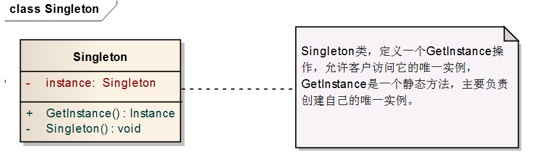

----------
# 标题：设计模式之单例模式

>生活中随处可见单例模式应用：如计算机系统的计时器，打印机服务,应用程序的日志应用,数据库连接池的设计等

## 基本概念
**单例模式（Singleton Pattern）**：单例模式确保某一个类只有一个实例，而且自行实例化并向整个系统提供这个实例，这个类称为单例类，它提供全局访问的方法。通俗来讲就是当前系统里面只能有一个实例对象，它必须由自己创建唯一实例，它也必须提供给别的对象使用这个唯一实例。单例模式是一种**创建型模式**。

## 使用场景

1. 控制资源的情况下，方便资源之间的互相通信。
2. 资源共享的情况下，避免由于资源操作时导致的性能或损耗等。


## 类图
单例模式的类图如下：

单例模式的构造方法应该是私有的，这样才能保证类不能随意被实例化（当然反射的方式暂时不讨论）。
这样Singleton的唯一实例只能通过getInstance()方法访问

## 代码实现
单例模式的代码实现方式有好几种，但万变不离其宗。
这里主要介绍常见的2种单例模式：懒汉式单例模式，饿汉式单例模式，另外介绍线程安全的单例模式。

**懒汉式单例模式**：instanceLazy的唯一获得方法就是getInstanceLazy()静态方法，在第一次被使用时才会实例话，可以避免内存的浪费。

```
package single_pattern;
/**
 * <p>title: 懒汉式单例模式</p>
 * <p>description:</p>
 * @ClassName: Singleton
 *
 * @author zhijun.chen
 * @date 2016年7月7日 下午4:04:10
 * @version 1.0.0
 *
 */
public class Singleton{
	
	//私有化构造方法
	private Singleton(){}
	
	//保证所需的实例只有一个
	private static Singleton instanceLazy=null;
	
	//静态方法
	public static Singleton getInstanceLazy(){
		if(instanceLazy==null){
			instanceLazy=new Singleton();
		}
		return instanceLazy;
	}

}
```

像上面的单例模式创建方式在一个线程下是安全的，但是在多线程中是不安全的，并发环境下容易出现多个实例。改进方式：

1：同步方法

```java
	public synchronized static Singleton1 getInstanceLazy(){
		if(instanceLazy==null){
			instanceLazy=new Singleton1();
		}
		return instanceLazy;
	}

```
优点：使用synchronize关键字给方法加锁，能够保证单例。

缺点：加锁影响效率（多线程情况下，每次获取实例时都是同步的）。

2:双重锁检测

```java
	//静态方法
	public static Singleton2 getInstanceLazy(){
		
		if(instanceLazy==null){//第一次检测
			synchronized (instanceLazy) {//同步，加锁
				if(instanceLazy==null){//第二次检测
					instanceLazy=new Singleton2();
				}
			}
		}
		return instanceLazy;
	}
```
优点：资源利用率高, 不执行getInstanceLazy就不会被实例，可以执行该类其他静态方法。

缺点：第一次加载时反应不快，由于java内存模型一些原因偶尔失败（Java内存模型了解不深入，不敢妄下结论，如果读者有兴趣爱好可以自己去查询资料）

3：静态内部类

```java
package single_pattern;
/**
 * <p>title: 懒汉式单例模式_静态内部类</p>
 * <p>description:线程安全</p>
 * @ClassName: Singleton
 *
 * @author zhijun.chen
 * @date 2016年7月7日 下午4:04:10
 * @version 1.0.0
 *
 */
public class Singleton3{
	
	//静态内部类，保证只有当前类能访问
	private static class SingletonLazy{
		private static final Singleton3 INSTANCE=new Singleton3();
	}
	
	//构造方法私有，不对外公开
	private Singleton3(){}
	
	//提供对外接口访问
	public static final Singleton3 getSingleton3() {
		return SingletonLazy.INSTANCE;
	}
}

```
优点：资源利用率高, 不执行getInstance就不会被实例，可以执行该类其他静态方法。

缺点：第一次加载比较慢

>同步加锁的方法，多线程下总会有一些性能的影响。若对资源十分在意可以采用静态内部类，不建议采用懒汉式及双重检测。


**饿汉式单例模式**：类初始化时就实例化（预加载），相对懒汉式单例模式，更推荐使用饿汉式单例模式。

```java
package single_pattern.hungry;

/**
 * <p>title:饿汉式单例模式</p>
 * <p>description:类初始化时就已经自行实例化。</p>
 * @ClassName: Singleton
 *
 * @author zhijun.chen
 * @date 2016年7月7日 下午4:28:34
 * @version 1.0.0
 *
 */
public class Singleton {
	
	private Singleton() {}
	// 静态变量类初始化时就实例化
	private static Singleton hungryInstance=new Singleton();
	
	public static Singleton getSingleton(){
		return hungryInstance;
	}

}
```
优点：静态变量在类初始化时就已经存在静态块中了，所以天生线程安全，并且因为在已经有静态对象存在，所以调用时反应迅速。
缺点：资源利用率不高，可能永远不会调用getSIngleton方法，但执行该类的其它静态方法或者加载了该类（Class.forName()），静态块仍然实例化。

## 总结

单例模式的使用在各大系统中基本都可以看到，它虽然简单易用，但要用好也未必是件容易的事。单例模式要记住：1构造方法始终是私有的，2它是自己实例化自己，3它需要提供给别人用，所以要开放一个接口。单例模式的使用情况：系统只需要一个实例对象。

>声明:博主只是将学习过程中觉得有用的分享出来，当然博主现阶段水平有限，如果文章有误的地方还请原谅，你也可以给我们提供意见，或者修改文档。

## 参考文档
1. http://blog.csdn.net/jason0539/article/details/23297037/
2. http://blog.csdn.net/lilongsheng1125/article/details/7873515
3. http://blog.csdn.net/tanyujing/article/details/14160941
4. http://design-patterns.readthedocs.io/zh_CN/latest/creational_patterns/singleton.html#id3
5. http://www.blogjava.net/wangchenyang/archive/2011/09/05/363081.html

>博主github地址：戳==>[chenzhijun](http://www.github.com/chenzhijun)
>
>博主博客地址：戳==>[chenzhijun.top](http://www.chenzhijun.top)